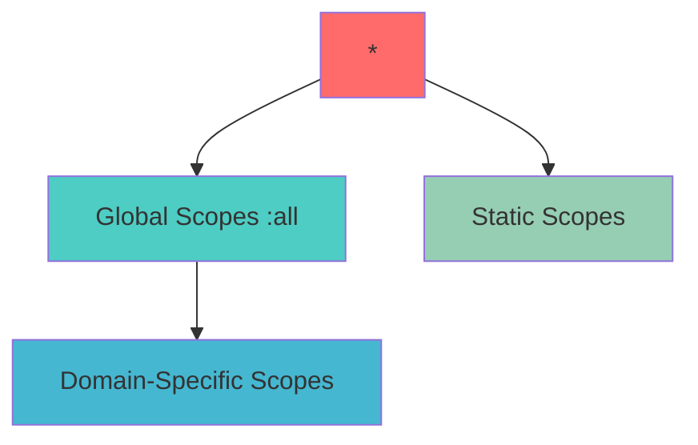

# API Key Scopes

API key scopes define the permissions and access levels for your API keys. They control which operations your API key can perform and which resources it can access. AhaSend uses a granular scoping system that allows you to grant only the minimum necessary permissions for enhanced security.

## Types of Scopes

AhaSend supports three types of scopes:

<AccordionGroup>
  <Accordion title="Static Scopes" icon="lock">
    Static scopes provide fixed permissions that don't change based on context. These are used for account-level operations and general resource access.

    Example: `accounts:read`, `domains:write`
  </Accordion>

  <Accordion title="Global Scopes" icon="globe">
    Global scopes end with `:all` and provide access to all resources of a specific type across all domains in your account.

    Example: `messages:send:all`, `webhooks:read:all`
  </Accordion>

  <Accordion title="Domain-Specific Scopes" icon="at">
    Domain-specific scopes are restricted to a particular domain. They use curly braces to specify the domain name placeholder.

    Example: `messages:send:{example.com}`, `routes:write:{mydomain.com}`
  </Accordion>
</AccordionGroup>

<Note>
  The wildcard scope `*` grants all permissions and should be used with extreme caution, preferably only for development and testing.
</Note>

## Available Scopes

### Account Management

| Scope | Description |
|-------|-------------|
| `accounts:read` | Read account information |
| `accounts:write` | Update account settings |
| `accounts:billing` | Access billing information |
| `accounts:members:read` | View account members |
| `accounts:members:add` | Add new account members |
| `accounts:members:update` | Update member permissions |
| `accounts:members:remove` | Remove account members |

### Domain Management

| Scope | Description |
|-------|-------------|
| `domains:read` | List and view domain information |
| `domains:write` | Add and update domains |
| `domains:delete:{domain}` | Delete a specific domain |

<Warning>
  Domain deletion requires a domain-specific scope for security. You cannot use a global scope for domain deletion.
</Warning>

### Message Operations

<Tabs>
  <Tab title="Global Scopes">
    | Scope | Description |
    |-------|-------------|
    | `messages:send:all` | Send messages from any domain |
    | `messages:cancel:all` | Cancel messages from any domain |
    | `messages:read:all` | Read messages from any domain |
  </Tab>

  <Tab title="Domain-Specific Scopes">
    | Scope Pattern | Description |
    |---------------|-------------|
    | `messages:send:{domain}` | Send messages from specific domain |
    | `messages:cancel:{domain}` | Cancel messages from specific domain |
    | `messages:read:{domain}` | Read messages from specific domain |
  </Tab>
</Tabs>

### Webhook Management

<Tabs>
  <Tab title="Global Scopes">
    | Scope | Description |
    |-------|-------------|
    | `webhooks:read:all` | Read webhooks for all domains |
    | `webhooks:write:all` | Create/update webhooks for all domains |
    | `webhooks:delete:all` | Delete webhooks for all domains |
  </Tab>

  <Tab title="Domain-Specific Scopes">
    | Scope Pattern | Description |
    |---------------|-------------|
    | `webhooks:read:{domain}` | Read webhooks for specific domain |
    | `webhooks:write:{domain}` | Create/update webhooks for specific domain |
    | `webhooks:delete:{domain}` | Delete webhooks for specific domain |
  </Tab>
</Tabs>

### Email Routing

<Tabs>
  <Tab title="Global Scopes">
    | Scope | Description |
    |-------|-------------|
    | `routes:read:all` | Read routes for all domains |
    | `routes:write:all` | Create/update routes for all domains |
    | `routes:delete:all` | Delete routes for all domains |
  </Tab>

  <Tab title="Domain-Specific Scopes">
    | Scope Pattern | Description |
    |---------------|-------------|
    | `routes:read:{domain}` | Read routes for specific domain |
    | `routes:write:{domain}` | Create/update routes for specific domain |
    | `routes:delete:{domain}` | Delete routes for specific domain |
  </Tab>
</Tabs>

### SMTP Credentials

<Tabs>
  <Tab title="Global Scopes">
    | Scope | Description |
    |-------|-------------|
    | `smtp-credentials:read:all` | Read SMTP credentials for all domains |
    | `smtp-credentials:write:all` | Create/update SMTP credentials for all domains |
    | `smtp-credentials:delete:all` | Delete SMTP credentials for all domains |
  </Tab>

  <Tab title="Domain-Specific Scopes">
    | Scope Pattern | Description |
    |---------------|-------------|
    | `smtp-credentials:read:{domain}` | Read SMTP credentials for specific domain |
    | `smtp-credentials:write:{domain}` | Create/update SMTP credentials for specific domain |
    | `smtp-credentials:delete:{domain}` | Delete SMTP credentials for specific domain |
  </Tab>
</Tabs>

### Suppressions

| Scope | Description |
|-------|-------------|
| `suppressions:read` | View suppression lists |
| `suppressions:write` | Add suppressions |
| `suppressions:delete` | Remove specific suppressions |
| `suppressions:wipe` | Clear entire suppression list |

### API Key Management

| Scope | Description |
|-------|-------------|
| `api-keys:read` | List and view API keys |
| `api-keys:write` | Create and update API keys |
| `api-keys:delete` | Delete API keys |

### Statistics and Reports

<Tabs>
  <Tab title="Global Scopes">
    | Scope | Description |
    |-------|-------------|
    | `statistics-transactional:read:all` | Read statistics for all domains |
  </Tab>

  <Tab title="Domain-Specific Scopes">
    | Scope Pattern | Description |
    |---------------|-------------|
    | `statistics-transactional:read:{domain}` | Read statistics for specific domain |
  </Tab>
</Tabs>

## Scope Validation and Hierarchy

### Validation Rules

1. **Domain Ownership**: Domain-specific scopes are only valid if you own the specified domain
2. **No Duplicates**: Duplicate scopes in the same API key are not allowed
3. **Redundancy Filtering**: Specific domain scopes are automatically removed if a global scope exists

<Note>
  If you have both `messages:send:all` and `messages:send:{example.com}`, only the global scope will be retained as it already covers the specific domain scope.
</Note>

### Scope Hierarchy



## Authorization Flow

When an API request is made, the system checks scopes in the following order:

<Steps>
  <Step title="Wildcard Check">
    If the API key has the `*` scope, access is granted immediately.
  </Step>

  <Step title="Exact Match">
    Check if the required scope exactly matches any of the API key's scopes.
  </Step>

  <Step title="Global Scope Check">
    For dynamic scopes, check if a corresponding `:all` scope exists.

    Example: `messages:send:{example.com}` is satisfied by `messages:send:all`
  </Step>

  <Step title="Domain-Specific Check">
    For domain-specific operations, check if the API key has the exact domain scope and verify domain ownership.
  </Step>
</Steps>

## Best Practices

<AccordionGroup>
  <Accordion title="Principle of Least Privilege" icon="shield-check">
    Grant only the minimum scopes necessary for your application to function. This reduces security risks if an API key is compromised.

    ```json
    // Good: Specific scopes for a newsletter application
    [
      "messages:send:{newsletter.com}",
      "suppressions:write",
      "statistics-transactional:read:{newsletter.com}"
    ]

    // Avoid: Overly broad permissions
    [
      "*"
    ]
    ```
  </Accordion>

  <Accordion title="Domain-Specific Scopes" icon="at">
    Use domain-specific scopes when working with multi-tenant applications or when you want to restrict access to specific domains.

    ```json
    // For a multi-tenant SaaS app
    [
      "messages:send:{client1.com}",
      "messages:read:{client1.com}",
      "webhooks:write:{client1.com}"
    ]
    ```
  </Accordion>

  <Accordion title="Separate API Keys" icon="key">
    Create separate API keys for different applications or environments with appropriate scopes for each.

    ```json
    // Production key - minimal scopes
    [
      "messages:send:all",
      "suppressions:write"
    ]

    // Admin key - broader access
    [
      "accounts:read",
      "api-keys:read",
      "domains:read"
    ]
    ```
  </Accordion>

  <Accordion title="Regular Scope Audits" icon="magnifying-glass">
    Regularly review your API key scopes and remove any that are no longer needed. Update scopes when your application requirements change.
  </Accordion>
</AccordionGroup>
